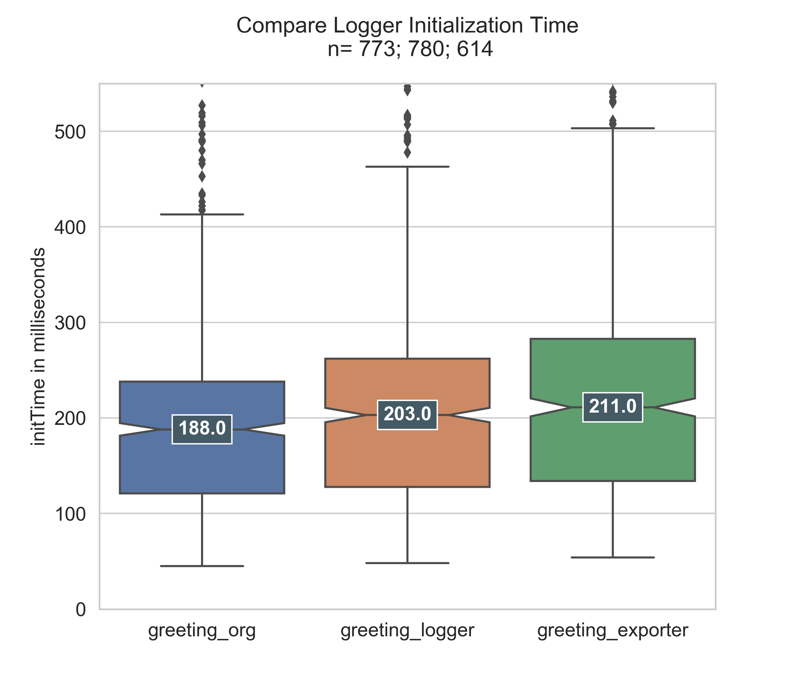
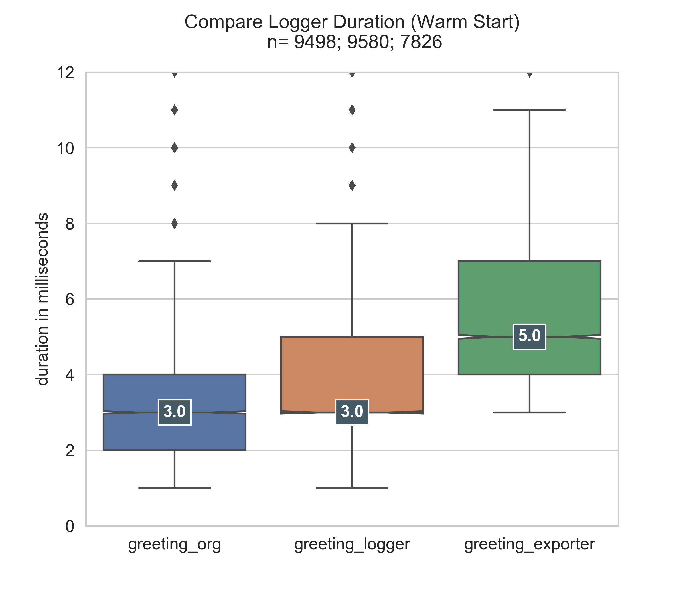

# openwhisk-instrumentation

A Node.js function wrapper to instrument [OpenWhisk actions](https://github.com/apache/openwhisk/blob/master/docs/actions.md) to generate and store metrics during execution.

The module allows to wrap OpenWhisk actions with minimal effort by two lines of code and generates the following metrics:

- Cold start indicator (Boolean)
- CPU Time of the process in milliseconds
- Average memory consumption in MB
- Input-parameter (as Hash value)
- Output-parameter (as Hash value)

Additional custom metrics can be attached during configuration.

## About instrumentation wrapper

In the context of computer programming, instrumentation refers to the measure of a product's performance, to diagnose errors, and to write trace information.
Programmers implement instrumentation in the form of code instructions that monitor and trace specific components in a system. - [Wikipedia](<https://en.wikipedia.org/wiki/Instrumentation_(computer_programming)>)

This code can be inserted into the source code itself or a wrapper can be used to add additional instrumentation behavior to a code entity. The wrapper takes a function as an input and a new function with additional behavior before and after the execution of the original function is returned. All parameters provided to the new function are passed through to the original one.

## Installation

```
$ npm install openwhisk-instrumentation --save
```

## Implementation

The module can be implemented by two lines of code: Importing the module and wrapping the exported function.

```javascript
const {owInstrumentation, config} = require('openwhisk-instrumentation');

const main = (params) => {
  const name = params.name || 'stanger';
  return {msg: `Hello World, ${name}!`};
};

module.exports.main = owInstrumentation(main);
```

By default, the collected metrics get logged to the Stdout:

```
"2020-05-11T16:08:36.8207801Z   stdout: METRIC COLDSTART 0",
"2020-05-11T16:08:36.8213629Z   stdout: METRIC INPUTHASH b849dca53a85606dd0fb247d0ad6130a6ee46da2",
"2020-05-11T16:08:36.8217714Z   stdout: METRIC OUTPUTHASH a93451f69c7640073e02455f946b09047f32d1a3",
"2020-05-11T16:08:36.8221925Z   stdout: METRIC CPUTIME_USER 193",
"2020-05-11T16:08:36.8226241Z   stdout: METRIC CPUTIME_SYSTEM 31",
"2020-05-11T16:08:36.8228241Z   stdout: METRIC MEMORY 31",
```

See [Storing metrics](#storing-metrics) for an additional configuration to send out metric values to an external service using HTTP POST requests.

## Configuration

### Metrics

The module will execute all metrics registered in `config.calculator` collection

The default metric handlers configured to run are:

- Cold start indicator (Boolean)
- CPU Time of the process in milliseconds
- Average memory consumption in MB
- Input-parameter (as Hash value)
- Output-parameter (as Hash value)

### Add a custom metric

An additional metric can be registered using the imported `config` object.

```javascript
config.calculator.push(sampleMetric);
```

A custom metric need to have the following convention:

```javascript
{
    name: 'MetricName',
    pre: function,
    post: function,
}
```

`pre` will be executed with invocation parameters before the wrapped function and `post` will be executed with return after invocation. An example can be found [here](./metrics/sampleMetric.js).

## Storing metrics

### Logger

Metric values collected during execution are logged to Stdout in the following format.

```
METRIC <metric name> <value>
```

The messages from the Stdout is available in the [OpenWhisk activation](https://github.com/apache/openwhisk/blob/master/docs/actions.md#understanding-the-activation-record) record of the corresponding activation in the logs array. The [wsk](https://github.com/apache/openwhisk-cli) cli command below will directly fetch the logs.

```
wsk activation logs -l
```

### HTTP POST exporter

A HTTP POST request exporter is also available in the `saver` dir with the name `exporter_saver.js`.

By overwriting the `saver` property on the `config` object, this option is used. You need to additionally add http request options.

Agents must be an object with a `save` method. This method is called with an array of metric values for each invocation.

```javascript
const {main, config} = require('../index.js');
const saverExporter = require('../saver/exporter_saver');

config.saver = saverExporter({
  hostname: 'HOSTENAME',
  port: 443,
  path: 'PATH',
  method: 'POST',
  headers: {
    'Content-Type': ['application/json'],
  },
});
```

### Performance Comparison

Both, logging and exporting via HTTP, must be evaluated and compared with a non-instrumented function in order to obtain a conclusion about the performance overhead of each alternative.

The instrumentation module was benchmarked using OpenWhisk deployed on a Google managed Kubernetes Cluster (GKE) made up of three 1-standard-1 instances, with each having 1 vCPU and 3.75 GB memory.

The very elementary greeting function was used as a reference. Beside that, two versions of the same functions were instrumented the openwhisk-instrumentation module. One version had implemented the logging method and the other exported the metrics via an HTTP POST request.

```javascript
/**
 * @params is a JSON object with optional fields "name" and "place".
 * @return a JSON object containing the message in a field called "msg".
 */
function main(params) {
  // log the parameters to stdout
  console.log('params:', params);

  // if a value for name is provided, use it else use a default
  var name = params.name || 'stranger';

  // if a value for place is provided, use it else use a default
  var place = params.place || 'somewhere';

  // construct the message using the values for name and place
  return {msg: 'Hello, ' + name + ' from ' + place + '!'};
}
exports.main = main;
```

These three versions were invoked alternately at intervals of 60 seconds with 30 simultaneous calls each. This workload pattern allowed to evaluate cold start behaviors, as well as warm start characteristics.



